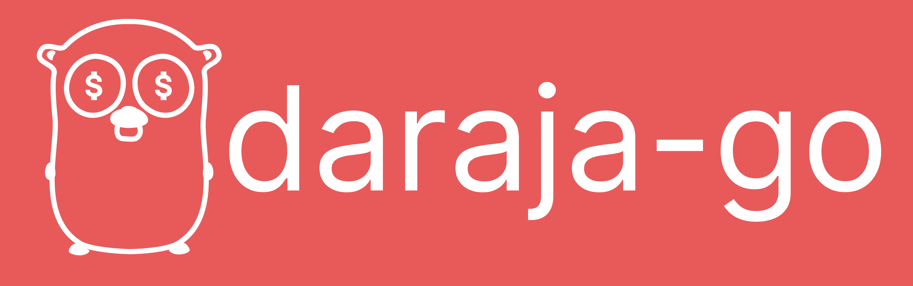

<p align="center">
<br><br>
<b>STILL IN BETA!</b><BR><BR>


</p>

<strong>daraja-go</strong> is a library that simplifies integration with the Daraja API in Go
applications. The Daraja API allows developers to build applications that interact with M-PESA, a popular 
mobile money service in Kenya. With daraja-go, developers can easily build M-PESA-powered applications and
bring the power of the Daraja API to their users. Released under the MIT License, daraja-go is easy to use 
and integrate into any Go project.

### Highlighted features
* **Automatic re-authentication:** daraja-go automatically reauthenticates with the Daraja API when the expiry time is reached.

* **Automatic generation of cipher text** for secret credentials: daraja-go automatically generates a cipher text of secret credentials using RSA-OAEP.
* **Singleton instance of DarajaApi struct:** daraja-go creates a singleton instance of the DarajaApi struct, which represents an instance of the Daraja API and contains various methods for interacting with the API.

### Getting started
* To get started with and enjoy daraja-go, you need to have a Daraja account. If you don't have one, you can create one [here](https://developer.safaricom.co.ke).
* Create a new application and generate a consumer key and secret. You can do this by clicking on the `My Apps` tab and then clicking on the `Create App` button.
*  Install daraja-go using the command below:
    ```bash
    go get github.com/oyamo/daraja-go
    ```
*  Import daraja-go in your project:
    ```go
    import "github.com/oyamo/daraja-go"
    ```
### Usage
*  Create a new instance of the DarajaApi struct:
   ```go
   import "github.com/oyamo/daraja-go"
   //...
   const (
        consumerKey = "E22yMhs"
        consumerSecret = "zAFGe5cWKv3U1HQ7"
   )
   daraja := darajago.NewDarajaApi(consumerKey, consumerSecret, darajago.ENVIRONMENT_SANDBOX)
   ```
    *  `consumerKey` is the consumer key generated for your application obtained from Safaricom Developer Portal.
    *  `consumerSecret` is the consumer secret generated for your application obtained from Safaricom Developer Portal.
      *  `environment` is the environment you want to use. It can either be `darajago.ENVIRONMENT_SANDBOX` or `darajago.ENVIRONMENT_PRODUCTION`.
<hr>

#### MPESAExpress (Previously STKPush)
This allows merchants to initiate a payment request on behalf of a customer using a PIN prompt. 
The customer will then be prompted to enter their M-PESA PIN on their phone to complete the transaction.

Use the **Password** from the developer portal.
```go
lnmPayload := darajago.LipaNaMpesaPayload{
  BusinessShortCode: "",
  Password:          "",
  Amount:            "",
  PartyA:            "",
  PartyB:            "",
  PhoneNumber:       "",
  CallBackURL:       "",
  AccountReference:  "",
  TransactionDesc:   "",
}

paymentResponse, err := daraja.MakeSTKPushRequest(lnmPayload)
if err != nil {
  // Handle error
 }
```

<hr>

#### Generating Mpesa Express QR Code
This allows merchants create a QR code that can be scanned by customers to make payments.
```go
qrPayload := darajago.QRPayload{
  MerchantName:          "",
  RefNo:                 "",
  Amount:                34,
  TransactionType:       darajago.TransactionTypeBuyGoods,
  CreditPartyIdentifier: "",
}
	
// Make a QR code request
qrResponse, err := daraja.MakeQRCodeRequest(qrPayload)
if err != nil {
  // Handle error
}
```

<hr>

#### Reversing a Transaction
This allows organisations to reverse a transaction that has been initiated by a customer. 

You will have to download a `.cer` file(contains the public key) from the developer portal. It is used to encrypt the password.
```go
certPath := "/path/to/certificate.cer" // download from safaricom developer portal
	
reversalPayload := darajago.ReversalPayload{
  Initiator:              "",
  PassKey:                "",
  TransactionID:          "NA548YGTB",
  Amount:                 "",
  ReceiverParty:          "", // Receiver phone number or till number or paybill number
  RecieverIdentifierType: "", // 1 for MSISDN, 2 for Till Number, 4 for Organization Short Code
  ResultURL:              "",
  QueueTimeOutURL:        "",
  Remarks:                "",
  Occasion:               "",
}

// Make a reversal request
reversalResponse, err := daraja.ReverseTransaction(reversalPayload, certPath)
if err != nil {
  fmt.Println(err)
  return
}
```

<hr>

#### B2C (Business to Customer Payment)
This allows organisations to send money from their M-PESA short code to a client's phone number. 
```go
certPath := "/path/to/cert.pem" // download from safaricom developer portal

b2cPayload := darajago.B2BPayload{
  InitiatorName:   "oyamosupermarket",
  PassKey:         "200",
  Amount:          "20",
  PartyA:          "",
  PartyB:          "",
  Remarks:         "",
  QueueTimeOutURL: "",
  ResultURL:       "",
  Occasion:        "",
}

// initiate b2c payment
b2cResponse, err := daraja.MakeB2CPayment(b2cPayload, certPath)
if err != nil {
  // handle error
}
```

<hr>

#### B2B (Business to Business Payment)
This allows organisations to send money from one organisation to another. 
```go
certPath := "/path/to/cert.pem" // download from safaricom developer portal

b2bPayload := darajago.B2BPayload{
  InitiatorName:   "oyamosupermarket",
  PassKey:         "200",
  Amount:          "20",
  PartyA:          "",
  PartyB:          "",
  Remarks:         "",
  QueueTimeOutURL: "",
  ResultURL:       "",
  Occasion:        "",
}

// initiate b2c payment
b2cResponse, err := daraja.MakeB2BPayment(b2bPayload, certPath)
if err != nil {
  // handle error
}
```

### Go Docs
*  [Go Docs](https://oyamo.github.io/daraja-go)
